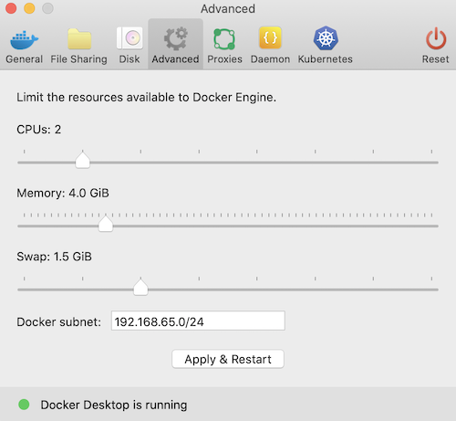

# Biocatalyst

## Setup
### Install Gradle
Download Gradle from their Releases page: https://gradle.org/releases/
Alternatively, if you use [Homebrew](https://brew.sh) you can run `brew install gradle`

### Install Docker
Download it from a link such as:
https://docs.docker.com/docker-for-mac/install/

### Increase memory allocated to Docker
As we're running a number of containers, we must increase the default memory allocated to docker. Open the docker settings and set the memory to 4GB.

### Make scripts executable (Mac)
If you're on a Mac, you'll need to give the scripts in this project executable permissions. Open terminal, and `cd` to the project repo. Then, run:  

`chmod +x scripts/*.sh`  
`scripts/setup.sh`  
  

Follow the next steps and start the stack with docker compose:  

`cd docker`  
`docker-compose up -d`  

## Try it out
Open a web browser and navigate to `http://localhost:4200` and you should be up and running!

## Utility scripts
You can run `scripts/clean_refresh.sh` It's highly recommended to run this script after a failed integration to ensure a clean starting point.

# Developer notes
You can run this either as a local docker stack (as above), which requires you to create a new local docker image with each code change. You can run `gradle docker` to build and tag with latest. Then, run `clean_refresh.sh` to pick up the newer container. This is using the `docker` set of configuration properties, e.g. `docker.properties` in the Spring apps' `resources` directory.

You can also run individual Spring applications with `gradle bootRun` using your IDE. This is much faster for local development, particularly if you're working on one or more service. This would use `local.properties`.

You can also mix and match and create your own custom configuration based on your needs.

In the event you make local changes and are running "in docker mode" - you can recreate all the docker containers with the latest tag locally by re-running `setup.sh`.

## Deployment
As these are containers, the plan is to provide environment-specific `properties` files and add them to the application classpath.
